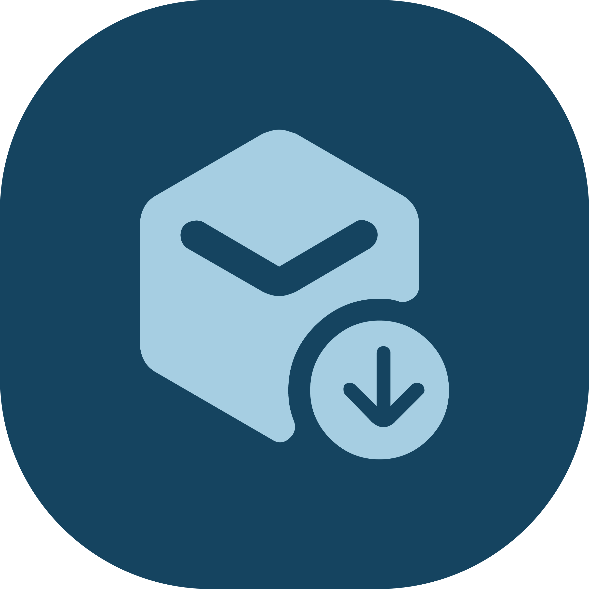
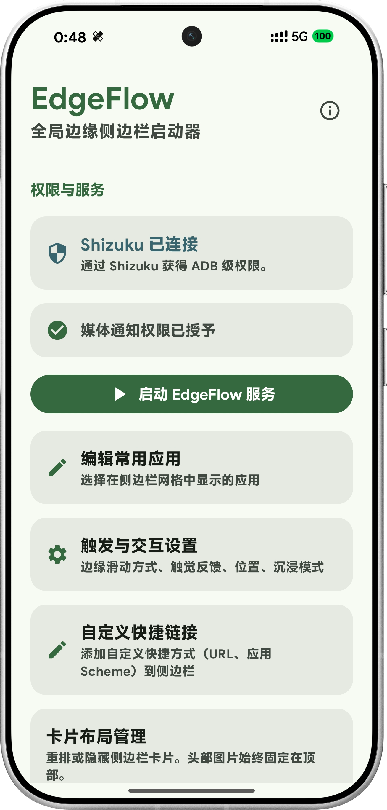
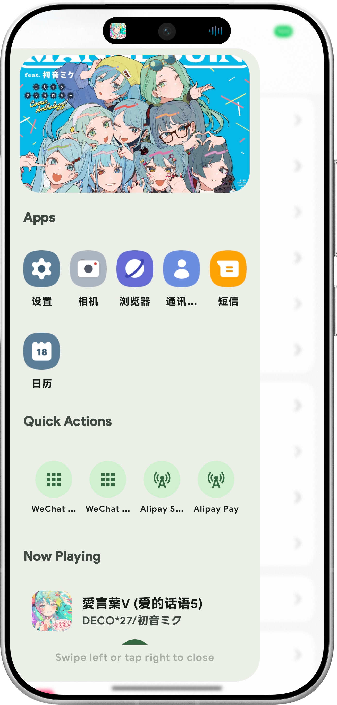
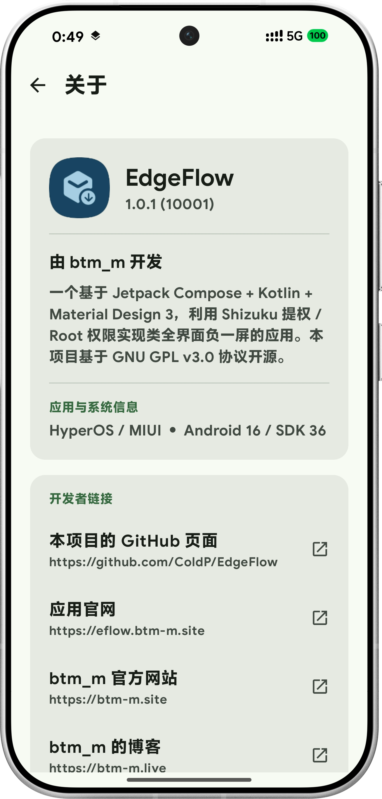

# EdgeFlow 中文介绍

<p align="center">
  
</p>

<p align="center">
  一个基于 Jetpack Compose + Kotlin + Material Design 3 打造的
  Android 全屏负一屏替代方案。
</p>

<p align="center">
  <a href="https://github.com/ColdP/EdgeFlow/releases">
    
  </a>
  
  
  
  <a href="README.md">
    
  </a>
</p>

---

## 预览

| 主界面 | 侧边栏 | 关于 |
|:---:|:---:|:---:|
|  |  |  |

---

## 功能特性

| 功能 | 说明 |
|---|---|
| 全屏负一屏 | 替代原生负一屏，支持手势触发 |
| Shizuku / Root 支持 | 获取更高系统权限，实现深层集成 |
| Jetpack Compose + MD3 | 现代流畅的 UI 体验 |
| 自定义侧边栏应用 | 自由选择和排列侧边栏中的应用 |
| 媒体监听服务 | 在负一屏展示正在播放的媒体信息 |
| 自定义快捷链接 | 可配置的快捷按钮 |
| 多语言支持 | 英文 + 中文（欢迎贡献更多语言！） |

---

## 技术栈

| 层级 | 依赖库 |
|---|---|
| UI | Jetpack Compose (BOM 2024.12.01) + Material Design 3 |
| 语言 | Kotlin 2.0.21 |
| 依赖注入 | Hilt 2.51.1 |
| 数据库 | Room 2.6.1 |
| 图片加载 | Coil 3.0.4 |
| 偏好设置 | DataStore Preferences 1.1.1 |
| 系统访问 | Shizuku API 13.1.5 |
| 页面导航 | Compose Navigation 2.8.5 |

**最低 SDK：** 28 (Android 9) &nbsp;|&nbsp; **目标 SDK：** 35 &nbsp;|&nbsp; **编译 SDK：** 35

---

## 从源码构建

### 前置要求

- Android Studio Hedgehog 或更新版本
- JDK 11 及以上
- 已安装 Android SDK Platform 35
- （可选）设备上安装 Shizuku 以使用完整功能

### 步骤

```bash
# 克隆仓库
git clone https://github.com/ColdP/EdgeFlow.git
cd EdgeFlow

# 构建调试 APK
./gradlew assembleDebug
```

APK 输出路径：`app/build/outputs/apk/debug/app-debug.apk`。

---

## 安装与使用

1. 在 Android 设备上安装 APK
2. 授予「在其他应用上层显示」权限
3. （推荐）安装并配对 **Shizuku** 以使用完整功能
4. 打开 EdgeFlow — 配置触发手势和侧边栏内容
5. 从屏幕边缘滑动即可唤起

---

## 项目结构

```
EdgeFlow/
├── app/                          # 主应用模块
│   ├── src/main/
│   │   ├── java/btm/m/edgeflow/ # Kotlin 源码
│   │   ├── res/                  # 资源文件（布局、字符串等）
│   │   └── AndroidManifest.xml
│   ├── build.gradle.kts          # 应用级构建配置
│   └── proguard-rules.pro       # 混淆规则
├── gradle/                       # Gradle 配置
├── build.gradle.kts               # 项目级构建配置
├── settings.gradle.kts            # 项目设置
├── README.md                      # 英文说明文档
├── README_zh.md                  # 中文说明文档
└── LICENSE                       # 开源许可证
```

---

## 贡献指南

欢迎提交 PR 和 Issue！

1. Fork 本仓库
2. 创建功能分支（`git checkout -b feature/功能名`）
3. 提交更改（`git commit -m "描述此次更改"`）
4. 推送到分支（`git push origin feature/功能名`）
5. 打开 Pull Request

更多贡献规范请参阅 [CONTRIBUTING.md](CONTRIBUTING.md)。

---

## 许可证

本项目以 [GNU General Public License v3.0](LICENSE) 开源。

---

## 链接

- **GitHub 仓库：** [github.com/btm-m/EdgeFlow](https://github.com/ColdP/EdgeFlow)
- **开发者网站：** [btm-m.site](https://btm-m.site)
- **博客：** [btm-m.live](https://btm-m.live)

---

> 由 [btm_m](https://github.com/ColdP) 制作
